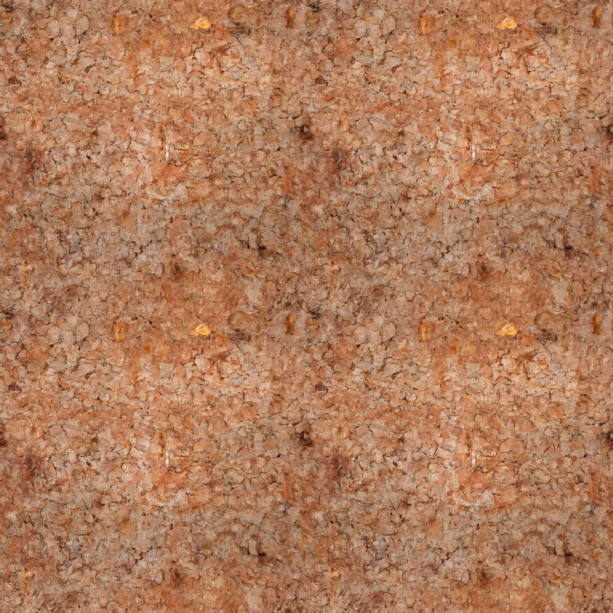
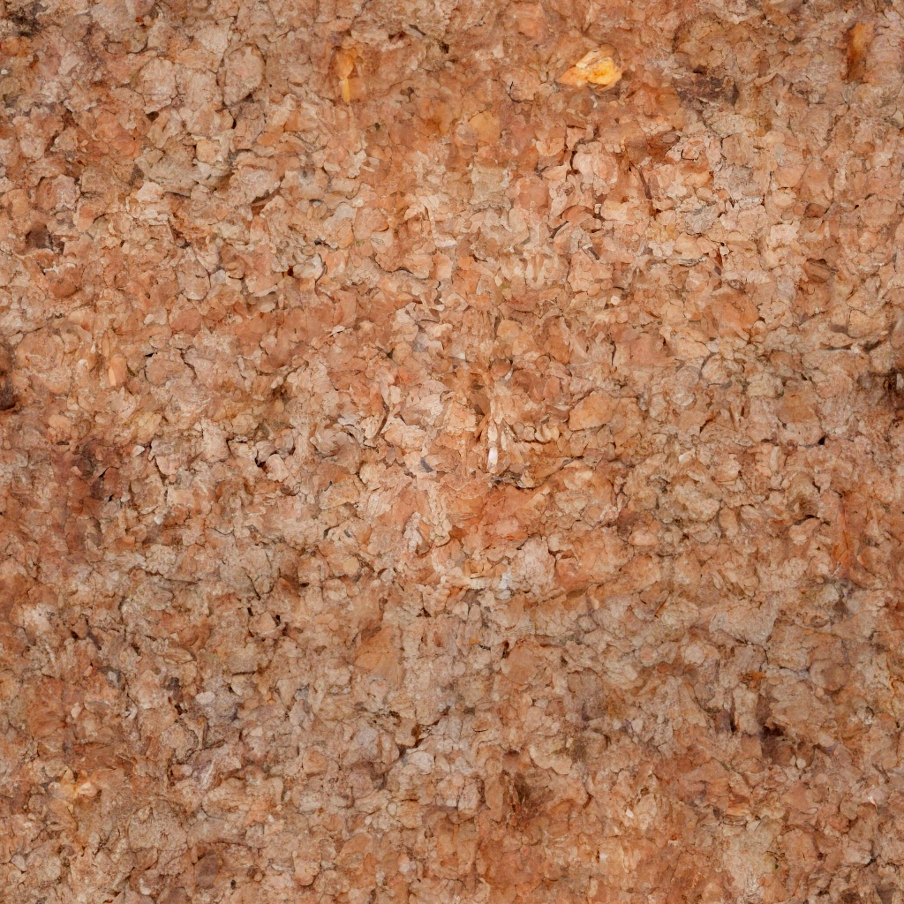
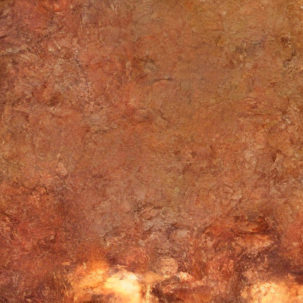

# DiffInfinite-Bark

Seamlessly tileable bark-texture synthesis with a torus-topology random patch
diffusion model. Built on top of [DiffInfinite (Aversa et al., NeurIPS 2023)](https://openreview.net/forum?id=QXTjde8evS),
retargeted from lung-cancer histopathology to spruce-log bark with three semantic
classes (`bark` / `knot` / `defect`), and extended with a new toroidal
sliding-window sampler so the generated images and masks tile perfectly in both
dimensions.

This repository is part of a master's thesis project by **Jakob Kreft**. It is a
derivative work — the original codebase, paper, and intellectual contribution
are by Marco Aversa and co-authors. See [LICENSE](LICENSE) and the citations
at the bottom of this README.



| Single tile | 2×2 tiled preview |
|---|---|
|  |  |

A single-patch sample (`sample_torus.py --uniform_size 512`):



---

## Pretrained model and dataset

Hosted on Hugging Face:

- **Model checkpoints**: https://huggingface.co/jakobkreft/diffinfinite-bark
- **Dataset (spruce-log bark segmentation, 680 image-mask pairs at 512×512)**: https://huggingface.co/datasets/jakobkreft/spruce-log-bark-segmentation

Classes in the dataset: `bark = 0`, `knot = 1`, `defect = 2`.

The training pipeline reads a flat folder of `<stem>.jpg` + `<stem>_mask.png`
pairs and random-crops each source to 512×512. The published checkpoints were
trained from 1024×1024 sources, where that crop supplies ±25% positional
jitter as augmentation. A folder of 512×512 pairs also trains without changes —
the crop simply degenerates to a no-op, so you lose the crop jitter.

---

## Install

Tested on Windows 10/11 + RTX 4000 Ada 20 GB, CUDA 11.x / 12.x.

```bash
git clone https://github.com/jakobkreft/diffinfinite-bark.git
cd diffinfinite-bark
pip install -r requirements.txt
```

`torch` and `torchvision` are intentionally unpinned — install the CUDA build
that matches your driver via https://pytorch.org/get-started/locally/ before
running `pip install -r requirements.txt`, or let pip resolve the CPU build if
you only need to read the code.

---

## Generate a tileable texture

Download the model checkpoints from Hugging Face into `./results/bark_200k/`
(the image model) and `./results/bark_masks/` (the mask model), then:

```bash
# Uniform mask, 2048x2048 tileable bark
python sample_torus.py \
    --uniform_size 2048 --uniform_class 0 \
    --results_folder ./results/bark_200k --milestone 40

# Or supply your own tileable mask PNG (single-channel, values in {0,1,2},
# dimensions multiples of 512):
python sample_torus.py --mask_path your_mask.png \
    --results_folder ./results/bark_200k --milestone 40
```

Both produce `torus_output.png` plus a `torus_output_2x2.png` 2×2 preview so
you can eyeball the seam quality.

To generate a tileable *mask* from scratch with the mask diffusion model:

```bash
python sample_torus_mask.py --image_size 2048 --label 1 \
    --results_folder ./results/bark_masks --milestone 12
```

For minimal smoke-testing on a single 512×512 patch, see
[inference-test.py](inference-test.py).

---

## Train

```bash
python train.py \
    --train_folder path/to/bark-pairs-1024 \
    --results_folder ./results/bark_run \
    --train_num_steps 200000 \
    --batch_size 4 --gradient_accumulate_every 4
```

`--train_folder` is a flat directory of `<stem>.jpg` + `<stem>_mask.png` pairs.
Sources are expected at 1024×1024: the pipeline takes a random 512×512 crop
(full ±25% positional jitter) on every step, so a few hundred source images
yield effectively unlimited unique training patches. Pass `--test_folder` to
hold out a folder for the periodic visualization snapshots; when it is omitted
(the default) those snapshots are drawn from `--train_folder` as a
deterministic center crop, and are a qualitative progress check rather than a
generalization measure.

Defaults match the parameters used to produce the published checkpoints:
3 data classes + 1 unconditional CFG class, OneCycleLR (`max_lr` 5e-5), EMA,
cosine β-schedule, P2 loss weighting (γ=1.0), DDIM-250 sampling, and
augmentation by flips + 90° rotations plus image-only color jitter
(disable with `--use_color_jitter False`). Loss and learning-rate curves are
written to `results/<run>/training_log.csv`, which also carries five
per-timestep-bucket loss columns; plot them with `python plot_loss.py`.

To train the mask diffusion model:

```bash
python train_masks.py \
    --data_path path/to/spruce-log-bark-segmentation \
    --results_folder ./results/bark_masks \
    --train_num_steps 60000
```

---

## Evaluate

The [scripts/](scripts/) directory holds the evaluation and figure-generation
tooling used for the thesis. Each script writes its raw measurements to CSV
first and can redraw its figure from that CSV alone (`--plot_only`), so plots
never require re-running generation.

| Script | What it measures |
|---|---|
| [eval_checkpoints.py](scripts/eval_checkpoints.py) | FID + KID across every `model-N.pt` in a run → `fid_curve.csv` / `.png` |
| [eval_sampling_steps.py](scripts/eval_sampling_steps.py) | FID + KID vs. DDIM step count at a fixed checkpoint (quality-vs-compute) |
| [eval_glcm.py](scripts/eval_glcm.py) | GLCM (Haralick) texture statistics: contrast, homogeneity, energy, correlation |
| [eval_gram.py](scripts/eval_gram.py) | VGG-19 Gram-matrix texture distance (Gatys), with a real-vs-real noise floor |
| [eval_components.py](scripts/eval_components.py) | Connected-component size distribution of the `knot` / `defect` mask classes |
| [visualize_denoising.py](scripts/visualize_denoising.py) | Denoising-trajectory figure (`pred_x0`, `raw_xt`, or both) + optional GIF |

```bash
# FID/KID curve over all checkpoints of a run
python scripts/eval_checkpoints.py \
    --results_folder ./results/bark_run \
    --source_folder ./data/diffinfinite-bark_1024 \
    --K 4 --sampling_steps 50

# Denoising trajectory figure for one checkpoint
python scripts/visualize_denoising.py --results_folder ./results/bark_run \
    --milestone 40 --mode both
```

FID/KID require `torch-fidelity` (in [requirements.txt](requirements.txt)).
KID is the more reliable headline number here — its U-statistic estimator is
approximately unbiased at the small reference-set sizes this dataset implies,
whereas FID carries a visible positive bias.

Note: `eval_glcm.py`, `eval_gram.py` and `eval_components.py` render their
plot labels in Slovene, matching the thesis they were written for.

---

## What's different from the original DiffInfinite

Concise summary of the substantive changes from upstream:

1. **Torus-topology sliding-window sampler.** New
   [random_diffusion_torus.py](random_diffusion_torus.py) adds
   `RandomDiffusionTorus` and `RandomDiffusionMasksTorus`, which subclass the
   upstream samplers and make the latent grid behave like a torus. Patches
   near the edges wrap to the opposite side, and the Hann-window decode uses
   `torch.roll` so the *outer* seam is blended (upstream only fixed interior
   seams). The UNet itself is unchanged.
2. **New `sample_torus.py` / `sample_torus_mask.py`** entry points for
   tileable image and mask generation, including support for rectangular
   outputs and uniform mask shortcuts.
3. **Bark dataset adapter.** [dataset.py](dataset.py) is a full rewrite. The
   upstream lung-cancer label remapping, `extra_unknown_data_path` dependency
   and empty-class-bucket bug are gone, and so is upstream's internal
   per-class train/test split — it overlapped train and test for multi-label
   images, leaving almost no clean held-out stems for FID. `BarkPairsDataset`
   now reads a flat folder of `<stem>.jpg` + `<stem>_mask.png` pairs, and
   `import_external_split` takes the train and test folders as explicit
   arguments instead of splitting internally.
4. **New simple mask loader.** [dataset_masks.py](dataset_masks.py) replaces
   the heavy upstream mask dataset with `SimpleMaskDataset`, which globs
   `*_mask.png` and uses the dominant class label per mask.
5. **Windows + single-GPU portability.** The unconditional `.module`
   accessors that assume DDP wrapping were replaced with `_get_vae()` and
   `hasattr(..., 'module')` checks throughout [dm.py](dm.py) and
   [dm_masks.py](dm_masks.py). `num_workers` defaults to 0 (Windows spawn
   safety). Scheduler-load is tolerant of `train_num_steps` mismatches.
6. **VAE source swap.** From the gated `stabilityai/stable-diffusion-2-base`
   to the public `stabilityai/sd-vae-ft-mse` (same architecture, MSE-tuned).
7. **CSV training log.** [dm.py](dm.py) writes `training_log.csv` with
   `(step, loss, lr)` plus five per-timestep-bucket loss columns, so loss
   curves survive checkpoint reloads. The bucket means are also stored in the
   checkpoint under `t_bucket_losses` (loading older checkpoints without that
   key still works).
8. **`plot_loss.py`.** New CLI for plotting the loss / LR / per-timestep-bucket
   curves from a checkpoint.
9. **Slimmer dependencies.** [requirements.txt](requirements.txt) drops
   pyarmor / pyinstaller / pinned CUDA libs; `environment.yaml` (Linux-locked
   conda snapshot) is removed.
10. **Sampler termination fix.** All three random-patch samplers decided they
   were finished with `times.float().mean() != sampling_steps - 1`. Above
   roughly 65k latent cells the sum of the per-cell step counts exceeds
   float32's exact-integer ceiling (2²⁴), so that equality can never become
   true and generation hangs at a printed "100.00%". The loops now test
   `times.min() < target` in integer space, which fixes large-canvas
   generation in [random_diffusion.py](random_diffusion.py),
   [random_diffusion_masks.py](random_diffusion_masks.py) and
   [random_diffusion_torus.py](random_diffusion_torus.py).
11. **Crop-based augmentation pipeline.** Training now draws a random 512×512
   crop from 1024×1024 sources with flips and 90° rotations, and applies
   color jitter to the image only (the mask holds integer class labels and
   would be corrupted by it). `ComposeState` re-seeds the RNG so image and
   mask receive identical spatial draws. The eval pipeline uses a
   deterministic center crop with no augmentation, so visualization snapshots
   are comparable across milestones.
12. **P2 loss weighting enabled** (γ=1.0, via `--p2_weight_gamma`), shifting
   gradient toward the high-noise content stage. The machinery is upstream's;
   upstream left it switched off.
13. **Evaluation suite.** New [scripts/](scripts/) directory — FID/KID over
   checkpoints and over DDIM step counts, GLCM and Gram-matrix texture
   statistics, connected-component mask statistics, and the denoising
   trajectory figure. See *Evaluate* above.
14. **Offline VAE fallback.** `AutoencoderKL.from_pretrained` is retried with
   `local_files_only=True` on `OSError`, so a cached VAE still loads when the
   Hugging Face handshake fails.

The original UNet, DDIM sampler, P2-weighting machinery, EMA, cosine β-schedule,
classifier-free guidance, and the base `RandomDiffusion` / `RandomDiffusionMasks`
algorithms are upstream. The two base samplers are unchanged apart from the
termination fix in item 10; everything else in that list is kept as-is.

---

## Citations

If you use this work, please cite both the original DiffInfinite paper and the
master's thesis it underpins.

The original DiffInfinite paper:

```bibtex
@inproceedings{
aversa2023diffinfinite,
title={DiffInfinite: Large Mask-Image Synthesis via Parallel Random Patch Diffusion in Histopathology},
author={Marco Aversa and Gabriel Nobis and Miriam H{\"a}gele and Kai Standvoss and Mihaela Chirica and Roderick Murray-Smith and Ahmed Alaa and Lukas Ruff and Daniela Ivanova and Wojciech Samek and Frederick Klauschen and Bruno Sanguinetti and Luis Oala},
booktitle={Thirty-seventh Conference on Neural Information Processing Systems Datasets and Benchmarks Track},
year={2023},
url={https://openreview.net/forum?id=QXTjde8evS}
}
```

The thesis bibtex entry will be added here once the thesis is published.

---

## License and attribution

This repository is released under the MIT License, inheriting from the
upstream [marcoaversa/diffinfinite](https://github.com/marcoaversa/diffinfinite).
The original `Copyright (c) 2023 marcoaversa` notice is retained verbatim in
[LICENSE](LICENSE). All modifications described in *"What's different from
the original DiffInfinite"* above are © 2024–2026 Jakob Kreft, also released
under MIT.
